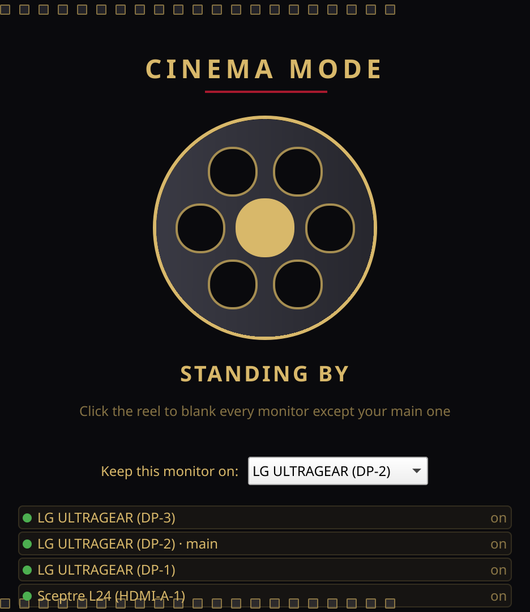
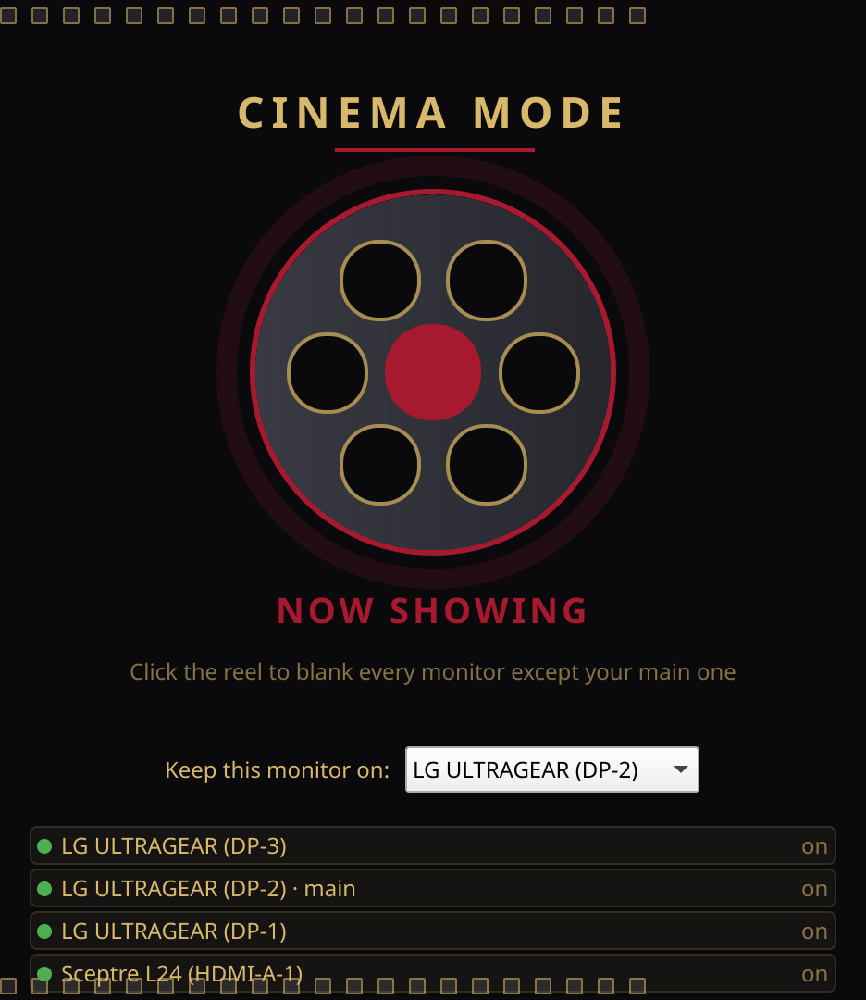

# Cinema Mode

One-click cinema mode for movie lovers with multi-monitor desks.

I've always loved movies really loved them, the kind where you dim the lights and give the screen your full attention. But at my desk, with two or three monitors glowing on either side, a movie never quite felt like a movie. There was always some other window spilling light into the room, pulling my eyes away from the story.

Cinema Mode is the fix I built for that. One click before the movie starts, and every monitor except the one you're watching on actually turns off no dimming tricks, no black overlay windows, the displays themselves go dark. Click again when the credits roll, and everything comes back exactly where you left it.

Made with love, for cinema lovers everywhere.




## Features

- One click to blank every monitor except the one you choose
- Instantly restores every display to its exact previous position and resolution
- Remembers your favorite "main" monitor between launches
- A cinema-themed interface that feels like part of the show
- Global keyboard shortcut (`Meta+Shift+C` by default, remappable in System Settings → Shortcuts → Cinema Mode) to toggle without opening the window
- System tray icon — left-click toggles cinema mode directly; right-click gives you "Show Window" and "Quit"

Closing the window does **not** quit the app — it keeps running in the tray so the shortcut and tray icon keep working. Use the tray icon's right-click menu to actually quit.

## Requirements

- KDE Plasma (Wayland or X11) — uses `kscreen-doctor` under the hood
- Qt6 (Core, Gui, Widgets, Qml, Quick, QuickControls2), Kirigami, KGlobalAccel, and KStatusNotifierItem (all KF6)

## Building from source

```bash
cmake -B build -DCMAKE_BUILD_TYPE=Release
cmake --build build
./build/cinemamode
```

To install system-wide:

```bash
sudo cmake --install build
```

## Installing

- **AUR**: not yet published (see `packaging/PKGBUILD`)
- **Flathub / KDE Store**: not yet published

## License

GPL-3.0-or-later — see [LICENSE](LICENSE).
